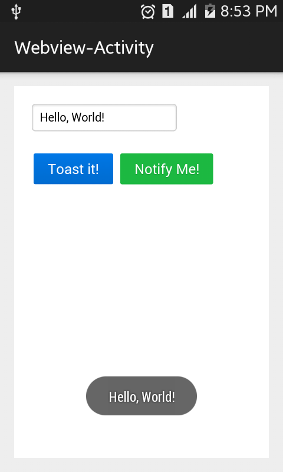
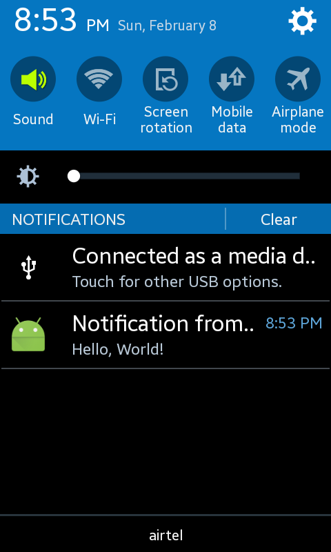

# Android-JavascriptInterface-Sample

Call Java (Android) methods from Webview using Javascript

## Howto

* Create a class named `JSInterface` inside any Activy or other Intent
* Create a public method with `@JavascriptInterface` annotations (<span style="color: red">DO NOT MISSPEL THIS</span>)
    ```java
        public class JSInterface {
        ...
        @JavascriptInterface
        public void toastMe(String text) {
            Toast.makeText(mContext, text, Toast.LENGTH_SHORT).show();
        }
    }
    ```
* Call `JSInterface.toastMe(text)` from Webview's Javascript instance
    ```javascript
    var text = "I want to be toasted";
    JSInterface.toastMe(text);
    ```

## Screenshot



